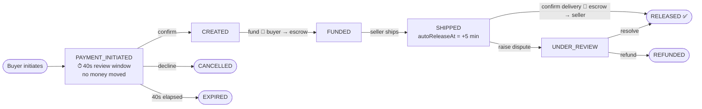
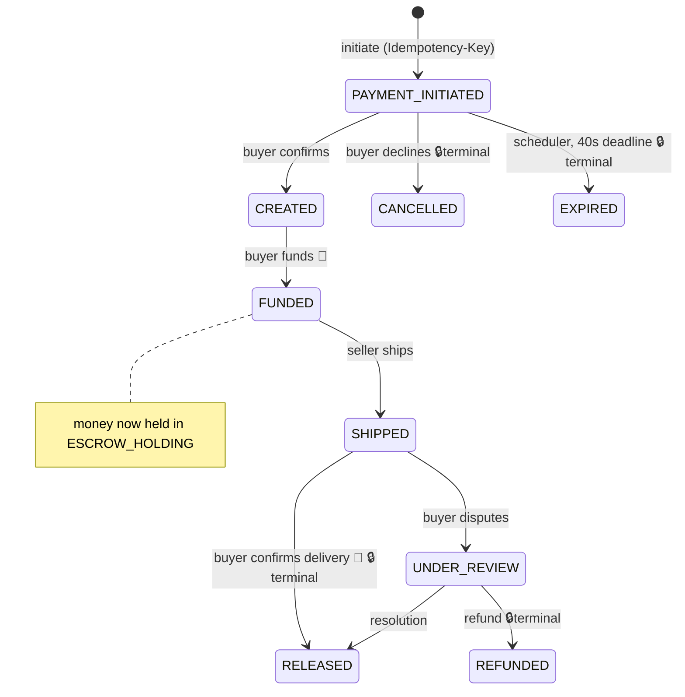
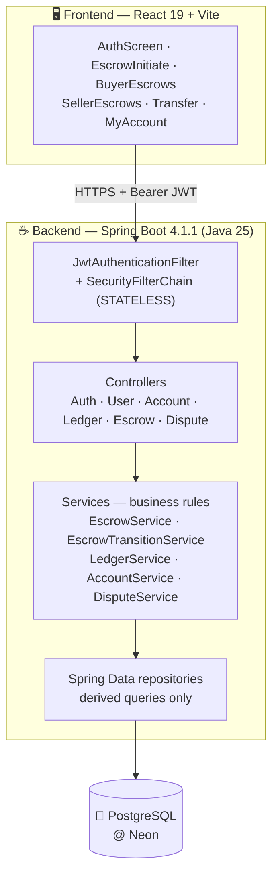

<div align="center">


# ⚡ RevertPay v1.0

### *Trust, engineered — escrow payments with a double-entry core*

**Buy safely. Ship confidently. Release with proof.**

[](https://openjdk.org)
[](https://spring.io/projects/spring-boot)
[](https://neon.tech)
[](https://react.dev)
[](https://vite.dev)
[](https://jsonwebtoken.readthedocs.io)

**status:** `v1.0-SNAPSHOT` — working core, active roadmap ↓

</div>

---

## 📌 What is RevertPay?

**RevertPay** is an **escrow-based payment platform**. When a buyer purchases an item, the money doesn't go to the seller — it goes into a **system-controlled escrow account** (`ESCROW_HOLDING`). The seller ships knowing the money is locked. When the buyer confirms delivery, a **double-entry ledger transaction** releases the funds to the seller. If something goes wrong, the buyer can **raise a dispute** and freeze the payment for review.

> **The problem it solves:** strangers on the internet can't trust each other. Buyers fear paying and receiving nothing; sellers fear shipping and never being paid. RevertPay replaces *trust between parties* with *proof in a ledger*.

Every rupee movement is recorded as an **immutable, paired debit/credit entry**, every escrow moves through a **validated state machine**, and every state change is **audit-logged with actor and reason**. No balance column exists anywhere — balances are always *derived* from the ledger, so money structurally cannot appear or vanish without a trace.

---

## ✨ Feature Highlights

| | Feature | Where it lives |
|---|---|---|
| 🔐 | **JWT authentication** — HS256-signed tokens, 1-hour expiry, BCrypt password hashing, fully stateless API | `security/JwtService`, `security/JwtAuthenticationFilter`, `config/SecurityConfig` |
| 👥 | **Role-based access** — `BUYER`, `SELLER`, `ADMIN` roles enforced in service-layer ownership checks | `user/Role`, `escrow/EscrowService` |
| 🏦 | **Escrow holding account** — a SYSTEM-owned `ESCROW_HOLDING` account auto-provisioned at startup | `account/AccountService`, `RevertPayApplication` |
| 💰 | **Double-entry ledger** — every movement = one atomic debit + credit pair in `BigDecimal`, `reference_id`-linked to its escrow | `ledger/LedgerService`, `ledger/LedgerEntry` |
| 📊 | **Derived balances** — computed as `Σ credits − Σ debits`; the ledger is the single source of truth | `UserController`, `AccountController` |
| 🔄 | **Centralized state machine** — 9 states, illegal transitions rejected, exhaustive compile-checked switch | `escrow/EscrowTransitionService` |
| 🧾 | **Full audit trail** — every transition logged (from → to, actor, reason, timestamp) | `escrow/EscrowStatusLog*` |
| ⏱️ | **Payment review window** — unconfirmed payments expire after 40 s via a 5-second scheduler sweep | `escrow/EscrowScheduler`, `EscrowService.checkExpiry` |
| 🚚 | **Shipping & auto-release window** — `shippedAt` + `autoReleaseAt` (+5 min) recorded on ship | `escrow/EscrowService.shipTransaction` |
| ⚠️ | **Disputes** — 7 reason codes, escrow frozen into `UNDER_REVIEW`, dispute record persisted | `dispute/DisputeService` |
| 🔁 | **Idempotency-Key enforced** on escrow initiation, backed by a unique DB constraint | `escrow/EscrowController`, `EscrowTransaction` |
| ⚡ | **Optimistic locking** — `@Version` on the escrow row makes concurrent double-releases impossible | `escrow/EscrowTransaction` |
| 🖥️ | **React 19 dashboard SPA** — auth, account lookup, transfers, buyer/seller escrow workspaces, dispute form | `frontend/src/components/*` |

---

## 🔄 The Escrow Lifecycle



**Money moves at exactly two points:** funding (buyer → escrow) and release (escrow → seller). Every other transition is pure state — cheap, safe, reversible by design.

---

## 🧬 State Machine

Transitions are validated in **one place** — `EscrowTransitionService.isValid()` — an exhaustive `switch` over all enum constants, so adding a new state **fails compilation** until its legal edges are defined.



Every legal transition appends an immutable row to `escrow_status_log` — *who*, *what*, *when*, and *why*.

---

## 🏗️ Architecture



**Request flow, one line:**
`fetch()` → Vite dev proxy → JWT filter (verify + load user) → URL authorization → controller (thin) → DTO `@Valid` → service (`@Transactional` boundaries) → repository → Hibernate → PostgreSQL.

---

## 💰 The Double-Entry Core

There is **no balance column**. Every account's balance is the sum of its immutable ledger entries — `Σ credits − Σ debits`. Every movement writes **exactly one debit and one credit, in one database transaction**, so the books always balance:

```
Σ all DEBIT amounts  ≡  Σ all CREDIT amounts   — always, by construction
```

**Example — a ₹1,000 trade (escrow #7):**

| # | Account | Type | Amount | Balance after | Meaning |
|---|---|---|---|---|---|
| 1 | `ESCROW_HOLDING` | DEBIT | 5000 | −5000 | platform mints the ₹5,000 signup credit |
| 2 | `ACC_buyer` | CREDIT | 5000 | **5000** | buyer's demo balance |
| 3 | `ACC_buyer` | DEBIT | 1000 | 4000 | 💸 funding escrow #7 |
| 4 | `ESCROW_HOLDING` | CREDIT | 1000 | **holding ₹1,000** | money locked mid-trade |
| 5 | `ESCROW_HOLDING` | DEBIT | 1000 | settled | 💸 delivery confirmed |
| 6 | `ACC_seller` | CREDIT | 1000 | 6000 | seller paid |

Every row carries `reference_id = 7`, so the complete money story of any escrow is one `WHERE` clause. While the escrow sits in `FUNDED`/`SHIPPED`, the escrow account's net equals **exactly** the amount held — a provable, reconcilable invariant, not a claim.

---

## 📡 API Reference

| Method | Endpoint | Actor | Purpose |
|---|---|---|---|
| `POST` | `/api/auth/register` | 🌐 public | register (name, email, BCrypt password, role) |
| `POST` | `/api/auth/login` | 🌐 public | authenticate → JWT (1 h) |
| `GET` | `/api/me` | any | profile + account + derived balance + full ledger |
| `GET` | `/api/accounts/{accNo}` | any | account lookup |
| `GET` | `/api/accounts/{accNo}/balance` | any | derived balance |
| `GET` | `/api/accounts/{accNo}/ledger` | any | full account statement |
| `POST` | `/api/auth/transfer` | any | plain double-entry wallet transfer |
| `POST` | `/api/escrow/initiate` | buyer | start escrow — **requires `Idempotency-Key` header** |
| `POST` | `/api/escrow/{id}/confirm` | buyer | approve payment review → `CREATED` |
| `POST` | `/api/escrow/{id}/cancel` | buyer | decline payment review → `CANCELLED` |
| `POST` | `/api/escrow/{id}/fund` | buyer | 💸 move money into escrow → `FUNDED` |
| `POST` | `/api/escrow/{id}/ship` | seller | mark shipped, set auto-release window |
| `POST` | `/api/escrow/{id}/confirm-delivery` | buyer | 💸 release money to seller → `RELEASED` |
| `POST` | `/api/escrow/{id}/dispute` | buyer | freeze escrow → `UNDER_REVIEW` |
| `GET` | `/api/escrow/buyer` | buyer | my purchases |
| `GET` | `/api/escrow/seller` | seller | my sales |

---

## 🚀 Getting Started

### Prerequisites
- **Java 25** (JDK)
- **Node.js 18+**
- A **PostgreSQL** database (local, or a free [Neon](https://neon.tech) instance)

### 1 · Configure the backend

`Revertpay/backend/src/main/resources/application.properties`:

```properties
spring.datasource.url=jdbc:postgresql://<host>:5432/<database>?sslmode=require
spring.datasource.username=<your-username>
spring.datasource.password=<your-password>
jwt.secret=<a-strong-secret-at-least-32-chars>
```

> ⚠️ **Note:** the checked-in `application.properties` points at a development database with placeholder-grade credentials and `ddl-auto=update`. Never ship those values anywhere real — rotate them and prefer environment-variable overrides in any shared or public deployment.

### 2 · Run the backend

```bash
cd Revertpay
./mvnw -f backend/pom.xml spring-boot:run
```

The app starts on **:8080**, creates the schema via Hibernate, and provisions the `ESCROW_HOLDING` system account automatically.

### 3 · Run the frontend

```bash
cd Revertpay/frontend
npm install
npm run dev
```

Open **http://localhost:5173** — Vite proxies `/api/*` to the backend, so everything works same-origin.

### 4 · Try a full trade 🎮
1. Register a **BUYER** and a **SELLER** (each gets a `ACC{id}` account + ₹5,000 demo credit)
2. As the buyer: **Escrow Payment** → enter the seller's account number, item, amount → *Initiate*
3. **Confirm** → **Fund** the escrow
4. As the seller: **Seller Escrows** → *Ship*
5. As the buyer: **Buyer Escrows** → *Confirm Delivery* 💸 — watch the ledger entries land

---

## 📂 Project Structure

```
Revertpay/
├── backend/                          # Spring Boot 4.1.1 · Java 25
│   ├── pom.xml
│   └── src/main/java/com/revertpay/
│       ├── RevertPayApplication.java   # @EnableScheduling + ESCROW_HOLDING bootstrap
│       ├── user/                       # User, Role, AuthService, AuthController, UserRepository
│       ├── account/                    # Account (no balance column!), AccountService, AccountController
│       ├── ledger/                     # LedgerEntry, Type (DEBIT/CREDIT), LedgerService, LedgerController
│       ├── escrow/                     # EscrowTransaction (@Version, idempotencyKey), EscrowStatus enum,
│       │                               #   EscrowService, EscrowTransitionService (state machine),
│       │                               #   EscrowStatusLog (audit), EscrowScheduler, EscrowController
│       ├── dispute/                    # Dispute (7 reason codes), DisputeService, DisputeController
│       ├── security/                   # JwtService, JwtAuthenticationFilter
│       ├── config/                     # SecurityConfig (BCrypt, STATELESS, CORS)
│       ├── dto/                        # validated request/response shapes
│       ├── exception/                  # domain exception types
│       └── scheduler/                  # background jobs
└── frontend/                         # React 19 + Vite 8
    └── src/
        ├── App.jsx                   # token session + page routing
        ├── components/               # AuthScreen, EscrowInitiate, BuyerEscrows,
        │                             #   SellerEscrows, Transfer, MyAccount, LedgerTable…
        ├── services/api.js           # endpoint registry
        └── utils/formatters.js       # INR money & date formatting
```

---

## 🗄️ Data Model

| Table | Purpose | Notable constraints |
|---|---|---|
| `users` | identity + role (`BUYER`/`SELLER`/`ADMIN`) | `email` UNIQUE, BCrypt `password` |
| `accounts` | wallet or system pot (`USER`/`SYSTEM`) | `account_number` UNIQUE — `ACC{id}` / `ESCROW_HOLDING` |
| `ledger_entry` | immutable money history | `account` FK, `DEBIT`/`CREDIT`, `BigDecimal amount`, `reference_id` |
| `escrow_transaction` | the trade agreement | buyer/seller FKs, `status`, `confirmation_deadline`, `idempotency_key` **UNIQUE**, `@Version` |
| `escrow_status_log` | transition audit trail | from → to, actor, reason, timestamp |
| `dispute` | review case per escrow | 7 reason enums, status |

---

## 🔐 Security Model

- **Stateless JWT** — HS256 signature + expiry verified on every request; the user is reloaded from the database so authorization always sees *current* roles
- **BCrypt** password hashing (encode on register, constant-time `matches()` on login, no user enumeration on failure)
- **URL-level rules** — only `/api/auth/register` and `/api/auth/login` are public; everything else requires authentication
- **Object-level ownership checks** — funding confirms *you are that escrow's buyer*, shipping confirms *you are its seller*, before any business logic runs
- **CSRF disabled, legitimately** — the API is Bearer-token-based with no ambient cookie credentials; `SessionCreationPolicy.STATELESS` throughout

---

## 🧪 Engineering Notes

- **Why derive balances?** Append-only entries can't suffer lost updates (no read-modify-write) and can't drift from their history — the trade-off is O(n) balance reads, which a snapshot/aggregate column fixes when needed without giving up the audit property.
- **Why a hand-rolled state machine?** Nine states and ten edges fit in one compile-checked switch — no dependency weight, and adding a state *forces* its legal transitions to be defined.
- **Why optimistic locking?** Escrow rows are touched ~5 times in their lifetime by exactly two parties — conflicts are rare, so a `@Version` compare-and-swap at commit beats lock waits. Two simultaneous releases: one commits, the loser's ledger writes roll back with its transaction.
- **Transactions where it matters** — both money flows (`fund`, `confirm-delivery`) wrap ledger pair + status change + audit log in a single `@Transactional` method. Money and state live or die together.

---

## 🗺️ Roadmap & Known Limitations

*Honest engineering — v1 is a working core with clear edges:*

- [ ] **Refund money-flow** — `UNDER_REVIEW → REFUNDED` is modelled in the state machine; the reversing transfer + admin resolution endpoint are next
- [ ] **Idempotent replay** — the `Idempotency-Key` unique constraint *rejects* duplicates today; the planned `idempotency_keys` table will *replay* stored responses (Stripe-style), and `EscrowRepository.findByIdempotencyKey` is already declared for it
- [ ] **Auto-release job** — `autoReleaseAt` is stored and displayed; enforcing it via a scheduled sweep (`EscrowAutoReleaseJob`) is on the board
- [ ] **Insufficient-funds gate** — atomic balance enforcement on fund/transfer paths
- [ ] **Global exception handler** — mapping domain exceptions to proper `400/401/403/404/409` responses
- [ ] **Test suite** — state-machine matrix first, then a two-thread release race test on Testcontainers PostgreSQL
- [ ] **Flyway migrations** — replacing `ddl-auto=update` for reviewable schema evolution
- [ ] **Hardening** — rate limiting on auth, secret management, FK indexes, structured logging

---

## 🛠️ Tech Stack

| Layer | Technology |
|---|---|
| Language | Java 25 |
| Framework | Spring Boot 4.1.1 (Web MVC, Data JPA, Security, Validation) |
| Auth | JWT (jjwt 0.13, HS256) + BCrypt |
| Database | PostgreSQL (Neon), Hibernate `ddl-auto=update` |
| Money type | `BigDecimal` — always |
| Frontend | React 19, Vite 8, vanilla fetch, CSS |
| Build | Maven wrapper (`mvnw`) |

---

## 👤 Author

**Siva Charan** — built end-to-end, from the double-entry core to the React dashboard.

<div align="center">

⭐ *If escrow + double-entry + optimistic locking in one codebase sounds like your kind of project, star the repo.*

</div>
